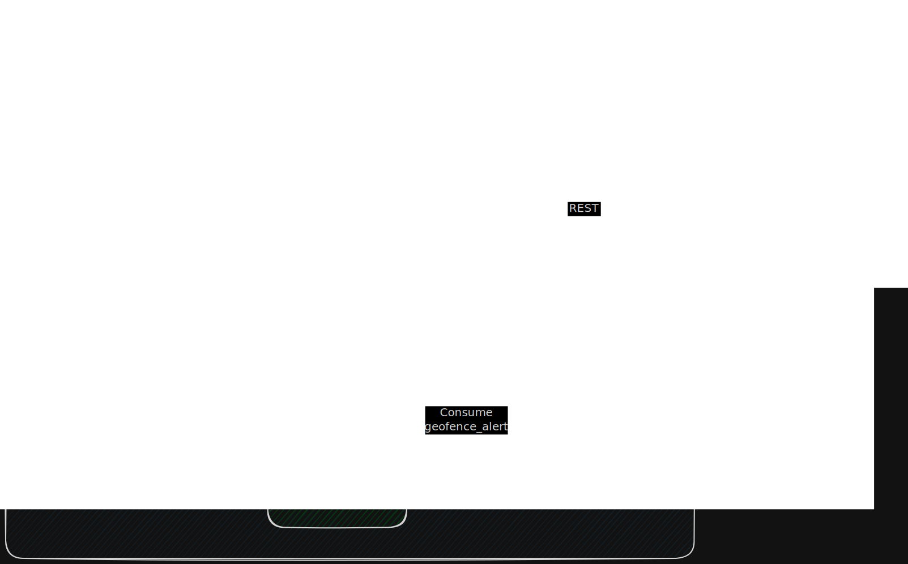

# Fleet Management System

[](https://opensource.org/licenses/MIT)

Go-based fleet management system that receives location data via MQTT, stores it in PostgreSQL, and processes geofence events via RabbitMQ.

## System Architecture



## Tech Stack

| Component | Technology |
|----------|-----------|
| Backend | Go 1.25, Gin |
| Database | PostgreSQL 15 |
| MQTT Broker | Eclipse Mosquitto 2 |
| Message Queue | RabbitMQ 3 |
| Container | Docker, Docker Compose |

## Postman Collection

The collection file is available in: `docs/collection/fleet-management.postman_collection.json`

### How to Import to Postman

1. Open Postman
2. Click **Import** (top left corner)
3. Select the file `fleet-management.postman_collection.json`
4. Click **Import**

### Changing Vehicle ID or Base URL

After importing, click on the collection name **Fleet Management API**, tab **Variables**:

| Variable | Default | Description |
|----------|---------|------------|
| `base_url` | `http://localhost:8080` | API URL |
| `vehicle_id` | `B1234XYZ` | The vehicle ID used for testing |

### Available Endpoints

| Method | Endpoint | Description |
|--------|----------|------------|
| GET | `/health` | Health check |
| GET | `/vehicles/{{vehicle_id}}/location` | Last known location |
| GET | `/vehicles/{{vehicle_id}}/history?start=&end=` | Location history |

### Getting Started

- Docker & Docker Compose installed.
- Go 1.25+ (only required to run the mock GPS publisher locally).

### 1. Clone & Setup Environment

```bash
git clone <repository-url>
cd fleet-management-service

cp .env.example .env
```

### 2. Run the Entire System

```bash
docker compose up
```

Wait until all services are healthy. Startup order:
1. `postgres`, `rabbitmq`, `mosquitto` — infrastructure
2. `api` — HTTP server + MQTT subscriber (depends on all infra)
3. `worker` — RabbitMQ consumer (depends on rabbitmq)

### 3. Verify Services are Running

```bash
# Check if all containers are running
docker compose ps

# Check API health
curl http://localhost:8080/health
```

### 4. Run Mock GPS Publisher

Open a new terminal (the publisher runs outside Docker for easier demonstration):

```bash
# Install dependencies
go mod tidy

# Run publisher — sends data every 2 seconds
MQTT_BROKER=tcp://localhost:1883 VEHICLE_ID=B1234XYZ go run ./scripts/mock_gps/main.go
```

The publisher simulates a vehicle that occasionally enters a geofence radius (roughly every 10 data points) to trigger events to RabbitMQ.

## API Endpoints

### Health Check

```
GET /health
```

### Get Last Known Location

```
GET /vehicles/{vehicle_id}/location
```

**Example:**
```bash
curl http://localhost:8080/vehicles/B1234XYZ/location
```

**Response:**
```json
{
    "success": true,
    "data": {
        "vehicle_id": "B1234XYZ",
        "latitude": -6.211954053168724,
        "longitude": 106.84243448721564,
        "timestamp": 1773594007
    }
}
```

### Get Location History

```
GET /vehicles/{vehicle_id}/history?start={unix_timestamp}&end={unix_timestamp}
```

**Example:**
```bash
curl "http://localhost:8080/vehicles/B1234XYZ/history?start=1715000000&end=1715099999"
```

**Response:**
```json
{
    "success": true,
    "data": [
        {
            "vehicle_id": "B1234XYZ",
            "latitude": -6.213048609661327,
            "longitude": 106.84136155716405,
            "timestamp": 1773593823
        },
        {
            "vehicle_id": "B1234XYZ",
            "latitude": -6.212758659720827,
            "longitude": 106.84162948244646,
            "timestamp": 1773593825
        },
        {
            "vehicle_id": "B1234XYZ",
            "latitude": -6.212506736352563,
            "longitude": 106.84191217073436,
            "timestamp": 1773593827
        }
    ],
    "meta": {
        "vehicle_id": "B1234XYZ",
        "total": 3
    }
}
```

## Geofencing

Geofence coordinate configurations are located in `.env`:

```env
GEOFENCE_LAT=-6.2088
GEOFENCE_LNG=106.8456
GEOFENCE_RADIUS_METER=50
```

When a vehicle is within a 50-meter radius of the coordinate, an event is sent to RabbitMQ in the following format:

```json
{
  "vehicle_id": "B1234XYZ",
  "event": "geofence_entry",
  "location": {
    "latitude": -6.2088,
    "longitude": 106.8456
  },
  "timestamp": 1715003456
}
```

## Monitoring

| Service | URL | Credential |
|---------|-----|------------|
| RabbitMQ Management UI | http://localhost:15672 | guest / guest |
| PostgreSQL | localhost:5432 | fleet_user / fleet_pass |
| MQTT Broker | localhost:1883 | - |

## Stopping the System

```bash
docker compose down

# Remove volumes (resets the database)
docker compose down -v
```